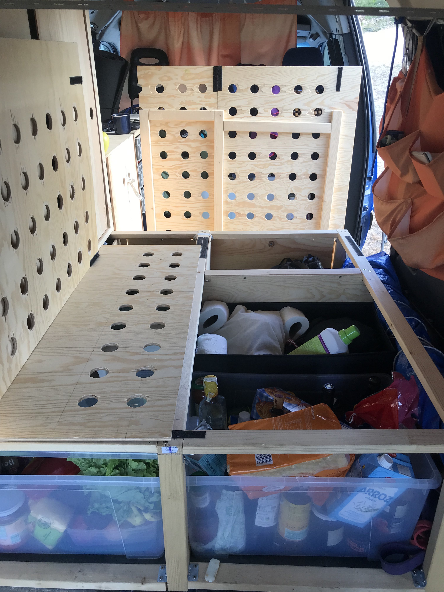
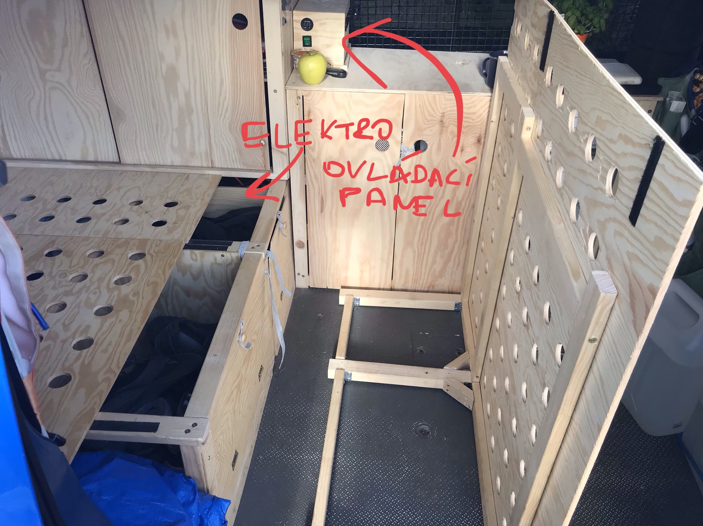
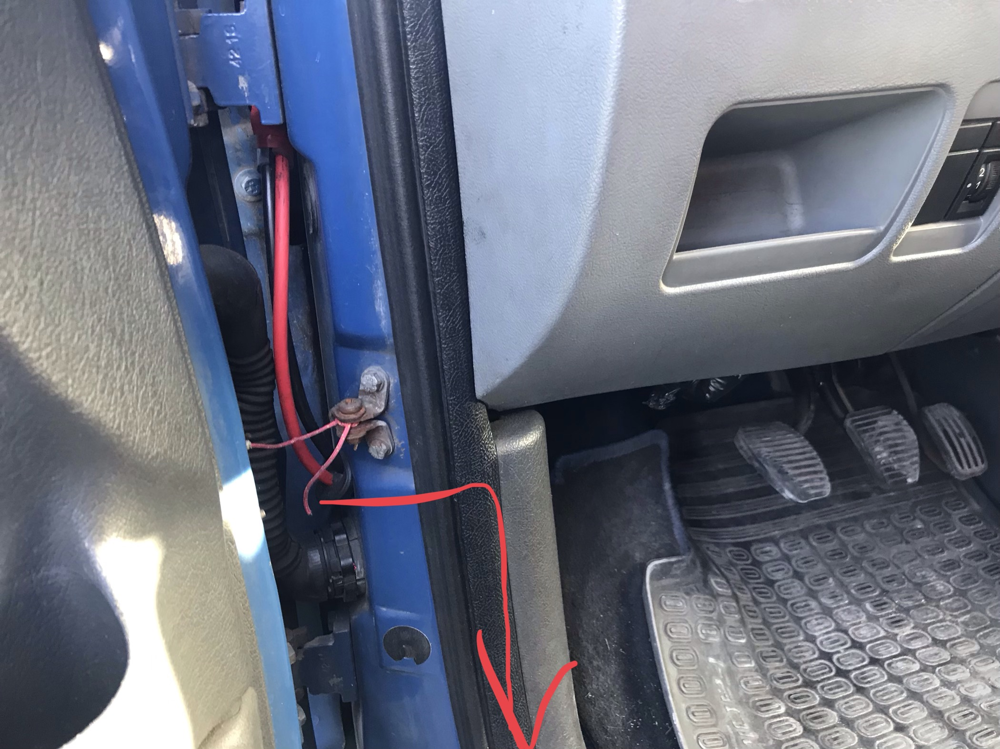

# Samodomo obytná vestavba Expert/Scudo/Jumpy <2006

Po měsící cestování Severem Španělska a nyní Portugalska (jeden měsíc je ještě před námi) bych se rád podělil o praktické rady ohledně vestavby do tohoto typu malého auta. Je to teda Expert v longu (a ten long je opravdu prakticky, v kratkem by bylo hodne tesno)

(V pozadí Nazaré, Portugalsko)

Pro trochu kontextu. Jsme dva. Na cestu mame dva mesice. U toho potrebujeme oba byt denne na pocitaci. Ja full-time pracuji (pokud to cte nejaky IT clovek co hleda misto kde je mozny full remote, tak se mi ozvete. Do firmy hledame sikovne vyvojare), pritelkyne dopisuje diplomku.

Dopadlo to tak, ze se soucasnym rozlozenim pri slozene posteli do vznikleho prostoru dame, bud
i) skladaci stul z decathlonu a jednu skladaci zidli. Druhy sedi na slozene posteli
ii) dve skladaci zidle

suma sumarum dokazeme normalne fungovat i na tak malem prostoru.

Styl cestovani je, ze na miste zustavame max 3 dny, pak se aspon trochu presouvame. To je dano hlavne tim, ze po teto dobe nam dochazi voda (20L v kanystrech), energie v baterce (za tuto dobu spotrebujeme odhadem 60Ah) a jidlo (nemame lednicku).

## Vestavba 

Ze sedadel vepředu při otočení hlavy to vypadá asi takto

Rozkladaci postel 200x115 cm (ja merim lehce pres 190cm) - sirka tak akorat. Pod postelí je spousta úložného prostoru

Desky postele  (8mm preklizka) jsou k zadni (staticke) casti konstrukce prichycene samolepicimi suchymi zipy. Nic neklouze, ale umoznuje to pristup k vecem vzadu (po sundani vysouvaci casti postele). Za me lepsi nez panty.

Mechanizmus vysouvani postele je trapne jednoduchy a osvedcil se. Nejsou treba kolejnicky, nic se nezasekava a postel je za par vterin rozdelana. Pak staci odrolovat matraci a muze se spat.

Vyvrtat diry do preklizek je urcite treba jednak kvuli odvetravani a odlehceni. V puvodni verzi (kdy  byla jenom postel pres cele auto bez skrinek) to nebylo a byl to problem. Nyni bych desky jeste necim natrel, vypada to ze kdyz se dele nevetra stejne trochu chytaji lehkou plisen.

---
Na posteli v zadní části leží skříňka s posuvnými dveřmi a 3 poličkami - 
skvele misto na odkladani obleceni. Vyzdvihnul bych soupaci dvirka jako nutnost, kdyby byly na pant, nevim jak bychom se do nich dostavali. Cela skrinka lezi **na** ramu postele (ta byla totiz puvodne pres celou sirku auta) a je prisroubovana ke stropu (pomoci L uhelniku a k ramu postele).

Takhle jsou udelane kolejnicky

Tim ze nemame doma frezku tak tatka (diky!) prisel s napadem udelat kolejnicky z malych bukovych hranolku ktere jsou tenkymi hrebicky pripevnene k ramu (predvrtat dirku nutnost!). Dvere jsou potom z 4mm preklizky.

Takhle vypada skrinka zevnitr (je to vpodstate takovy divny kvadr s bocnicemi z 4mm preklizky). Rozmery jsem delal +- a postupne dorezaval at to pekne padne, cely interier je zaobleny a tezko se to meri.

(Aby obleceni nelezelo primo na skle, prilepil jsem dozadu kus stribrne alumatky pomoci lepici pasky)
Celou tuhle skrinku povazuji za velky uspech a mam z ni radost :-)

---

 Skříňka s "kuchyňskou linkou" a šuplíky (kam se dá dostat jen se složenou postelí)

Kuchynska linka je 8mm překližka (a bohatě stačí)

Takto jsou vlozene supliky (prepravky z Hornbachu. Tim ze se daji skladat na sebe tak mají zabudované praktické drážky)

---

Jedna z "vychtavek" je tato ochranna mrizka (pletivo na kraliky) na soupacim okne. Kdyby nekdo chtel, tak neni problem se pres to dostat, ale dava to v noci aspon pocit bezpeci kdyz vetrame. A kdyby to nekdo zacal stipat klestema tak si rikam ze nas to vzbudi :-)

---
## Elektro

(disclaimer: nejsem elektrikar, neberte me vazne, na vlastni nebezpeci)

Trakcni baterka je 100Ah PbC http://shop.mypower.cz/baterie-lead-carbon-jpc-12v-100ah-3190 
Zatim funguje, ale to by po tak kratke dobe fungovala i klasicka autobaterka, takze k tomuto se necitim kompetentni vyjadrovat.

Dobijime pres Cyrix, kabely (16mm, delka asi 4m) zatim taky neshorely. Pojistku mam 80A. Co se osvedcilo, tak je vest kabel mezi baterkami pres bocni plech nad kolem (??)

a vyvod je tady

 a dale pak pod podlahou a za skirnkou k baterce, ktera je v nejhure pristupnem miste pod posteli/skrini.

Tohle je moje kabelove peklo. Priste urcite necham delsi kabely pro snadnejsi manipulaci a nejak je popisu, ale vpodstate jsem tuhle cast dodelaval v predvecer odjezdu. Doufam ze se v tom nikdo nebude muset hrabat po me :-). Nepodarilo se mi sehnat "Fusebox" (jak je ve vsech zahranicich yt videich) tak je to vyresene takovou "svorkovnici" (?) na DIN liste do ktere vede 10mm kabel z `+` od baterky (samozrejme pres pojistku - 60A) a z ni pak jednotlive tenci kabely do vlastnich okruhu. Tady ocenim jakekoliv postrehy. Klicove slova fastony a krimpovani.

Puvodne jsem chtel i nejaky flexibilni solar, ale nakonec jsem to risknul a ukazalo kdybychom ho meli tak ho vubec nepotrebujeme, cyrix nas (v nasich podminkach, viz uvod) bohate dobije a energie nas vubec nelimituje.

Invertor nemame, vsechno je na 12V (vpodstate 2x nabijecka na notebook, par svetylek). Jedno lenovo a jedne macbook (magsafe2). Apple 12V adapteru jsem moc nenasel, nakonec jsem vzal [tento](https://www.czc.cz/estuff-auto-adapter-microbattery-60w-magsafe-2-car-adapter/230275/produkt) a zatim funguje bez problemu. System ji teda rozpoznava jako 85W ale to neni na skodu.

Lednicku - nemame. Mame pasivni chladici box, ale vezeme v nem akorat par lahvi portskeho jako darky, jinak vsechno jidlo je v krabicich pod posteli. Zatim se nam nic nezkazilo (fuet, jamon, vajicka, jogurty) ale to je asi tim ze nakupujeme na 3 dny a na jare nejsou takove paraky. Nicmene je to bez lednicky uplne vpohode.

## Izolace
Nemame. Mame teple spacaky. Pod kapotou je nejake webasto, ale vypada ze nefunguje a asi je to stejne jen predehrev motoru.
